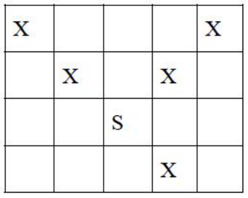

# 神 ( shen )
---
- ## [问题]

- ### [问题描述]
> 击败恶魔后,小 S 发现了一片 n*n 的神域,神是高傲的,他们总是斜着站且不希望自己的左右或前方有其它的神,现在小 S 想知道这片神域里最多能存在多少个神.下图是一个示例,S 位置是一个面朝右上的神,S 和 X 的位置不能再放其它的神,注意神一定是斜着的.

<!--more-->



- ### [输入格式]
> 第一行一个正整数 T 表示测试数据组数.接下来 T 行每行一个正整数 n.

- ### [输出格式]
> 对每组数据输出一行一个整数表示答案.

- ### [样例]

>> shen.in | shen.out
>> --------|---------
>> 1 | 4
>> 2 |

- ### [数据范围]
> 20%的数据:n≤4;
> 40%的数据:n≤5;
> 60%的数据:n≤6;
> 80%的数据:n≤7;
> 100%的数据:T≤10,N≤8.

- ## [代码]
```c++
#include "stdio.h"

const int AC[8]={1,4,6,8,11,14,17,20};

int t,n;

int main()
{
#ifndef ONLINE_JUDGE
    freopen("shen.in","r",stdin);
    freopen("shen.out","w",stdout);
#endif
    scanf("%d",&t);
    while(t--)
    {
        scanf("%d",&n);
        printf("%d\n",AC[n-1]);
    }
    return 0;
}
```
